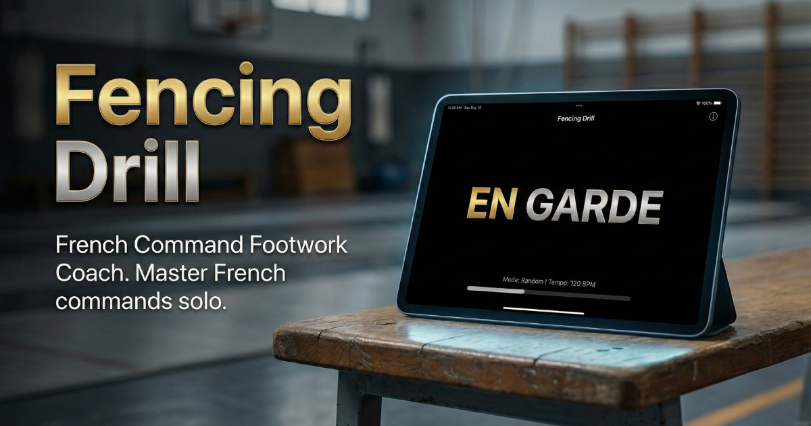

# Fencing Drill

[](https://github.com/nimamura/fencing-drill)
[](https://python.org)
[](LICENSE)

A solo footwork training app that calls out French fencing commands with audio. Practice like you have a coach.



## Live Demo

**Try it now:** [https://fencing-drill-production.up.railway.app/](https://fencing-drill-production.up.railway.app/)

Works on desktop and mobile. Install as a PWA for offline use in the gym.

## Why This App?

Every fencer knows the struggle: you want to practice footwork, but you don't have a coach or training partner available. You could count reps in your head, but that's not the same as reacting to commands.

This app solves that problem by:
- Calling out authentic French commands ("Marchez!", "Rompez!", "Fendez!")
- Randomizing commands to train your reaction time
- Adjusting tempo and intensity to match your training goals
- Working offline so you can use it anywhere — gym, home, or piste

## Features

- 4 training modes (Basic, Combination, Random, Interval)
- 3 weapon types with auto-adjusted tempo (Foil, Épée, Sabre)
- Authentic French fencing commands with audio
- Real-time command delivery via SSE
- PWA support for offline use in the gym
- Multi-language UI (Japanese, English, French)
- Mobile-friendly responsive design

## Training Modes

| Mode | Purpose |
|------|---------|
| **Basic** | Single command repetition for form practice |
| **Combination** | Preset patterns for movement coordination |
| **Random** | Unpredictable commands for reaction training |
| **Interval** | High-intensity intervals with rest periods |

## Commands

| French | Phonetic | Description |
|--------|----------|-------------|
| En garde | ahn GARD | Guard position |
| Marchez | mar-SHAY | Advance |
| Rompez | rom-PAY | Retreat |
| Fendez | fahn-DAY | Lunge |
| Allongez le bras | ah-lon-ZHAY luh BRAH | Extend arm |
| Remise en garde | ruh-MEEZ ahn GARD | Return to guard |
| Balancez | bah-lahn-SAY | Sway forward/back |
| Bond en avant | bohn ahn ah-VAHN | Jump forward |
| Bond en arrière | bohn ahn ah-ree-AIR | Jump backward |
| Flèche | FLESH | Running attack (Sabre only) |

## Weapons

Each weapon type has different tempo characteristics:

| Weapon | Tempo | Notes |
|--------|-------|-------|
| **Foil** | Standard (1.0x) | Default weapon, balanced training |
| **Épée** | Slower (0.8x) | More deliberate, emphasis on balancez |
| **Sabre** | Faster (1.3x) | Explosive movements, includes flèche |

## Tech Stack

- **Backend:** Python 3.11+, FastAPI
- **Frontend:** htmx, Tailwind CSS, Jinja2
- **Audio:** Pre-recorded MP3 files
- **Communication:** Server-Sent Events (SSE)

## Getting Started

### Prerequisites

- Python 3.11 or higher

### Installation

```bash
# Clone the repository
git clone https://github.com/nimamura/fencing-drill.git
cd fencing-drill

# Create virtual environment (recommended)
python -m venv venv
source venv/bin/activate  # On Windows: venv\Scripts\activate

# Install dependencies
pip install -r requirements.txt
```

### Running

```bash
# Start the development server
uvicorn main:app --reload

# Open in browser
open http://localhost:8000
```

### Testing

```bash
pytest
```

## Project Structure

```
fencing-drill/
├── main.py              # FastAPI application
├── logic/
│   ├── commands.py      # Command definitions
│   ├── generator.py     # Command generation per mode
│   ├── weapons.py       # Weapon profiles and tempo
│   └── session.py       # Session state management
├── templates/           # Jinja2 + htmx templates
├── static/
│   ├── audio/           # Command audio files (MP3)
│   ├── css/             # Stylesheets
│   └── js/              # JavaScript (audio, i18n)
└── tests/               # pytest test files (233 unit + 2 e2e)
```

## Contributing

Contributions are welcome! Here's how you can help:

1. **Report bugs** — Open an issue describing the problem
2. **Suggest features** — Training modes, commands, or UI improvements
3. **Submit PRs** — Bug fixes, new features, or documentation improvements
4. **Audio recordings** — Native French speakers welcome to contribute professional audio

### Development

```bash
# Run tests
pytest

# Run with auto-reload
uvicorn main:app --reload
```

## Roadmap

- [ ] Custom pattern creator
- [ ] Group/class training mode
- [ ] Training history and statistics
- [ ] Professional audio recordings

## License

MIT

---

Built with ⚔️ by a fencer, for fencers. *En garde!*
